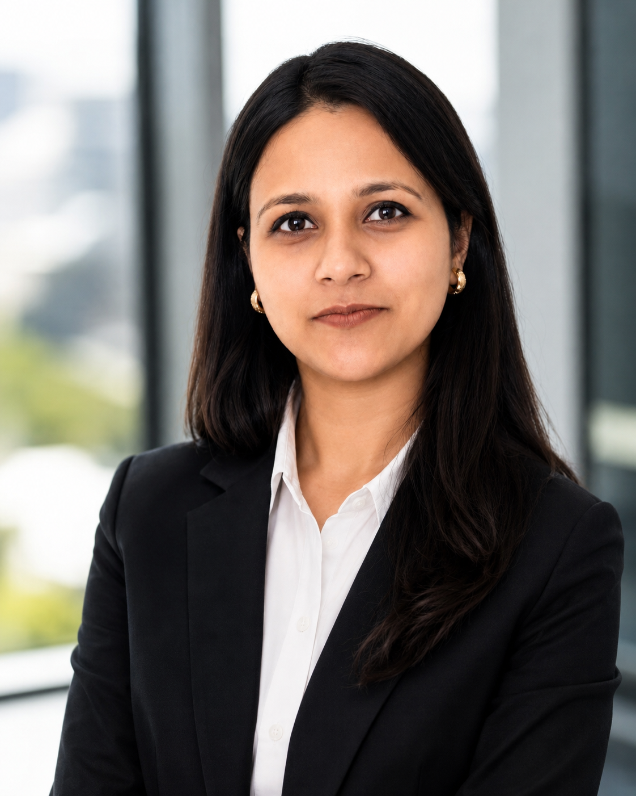

::: {.hero}

::: {.hero-text}

MDS Student at the University of British Columbia

# From analytics to data science.

I’m a data and analytics professional with several years of experience in analytics and business intelligence, working with international clients. I’m currently pursuing a Master of Data Science at the University of British Columbia, where I’m strengthening my skills in data science, machine learning, and analytical problem-solving. I’m interested in using data to uncover meaningful insights and build practical solutions to real-world problems. Through MDS, I hope to combine my analytics experience with deeper technical expertise.

  <a href="about.qmd" class="home-button">About Me</a>
  <a href="blog.qmd" class="home-button">Blog</a>

:::

::: {.hero-photo}

:::

:::