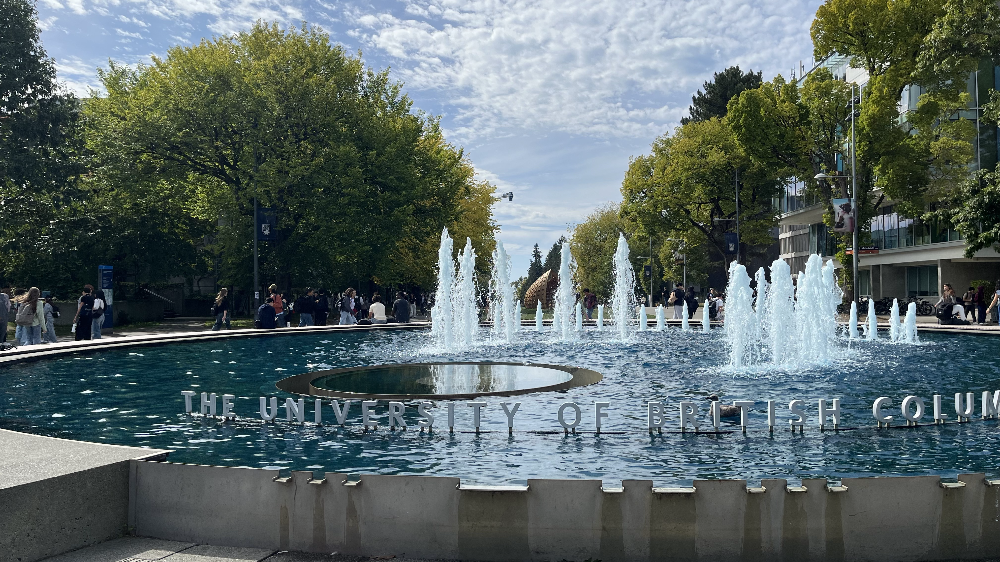

Starting the MDS program at UBC has been an exciting experience so far. The first few weeks have been a mix of orientation, meeting new people, getting familiar with the program, and settling into a new academic routine. It has been interesting to see how quickly the program has brought together people with different backgrounds and experiences.

One of the things that stood out to me was how quickly the pace picked up once classes began. There has already been a lot to learn, particularly around programming, statistics, and working with data. Coming from an analytics and business intelligence background, I’m looking forward to building on what I already know while developing stronger technical skills.

I’m still getting used to the workload and the rhythm of MDS, but I’m enjoying the challenge. I’m especially excited to see how the concepts we learn in class connect to real-world data problems and to the work I hope to do in the future.

